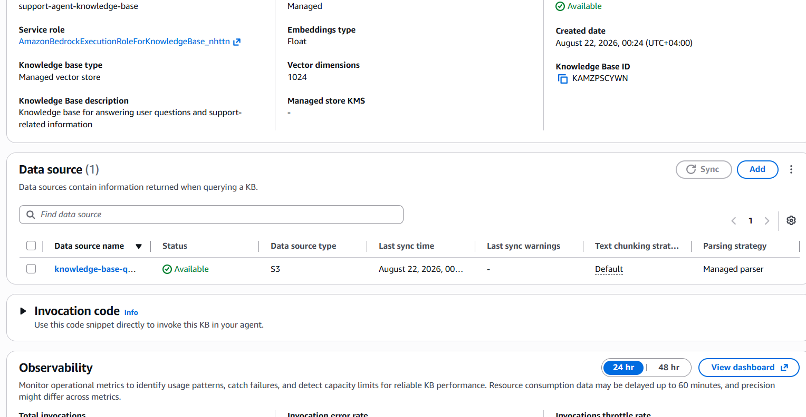
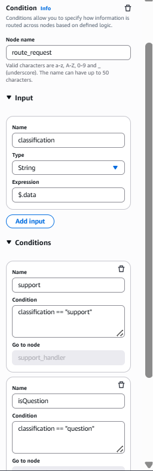
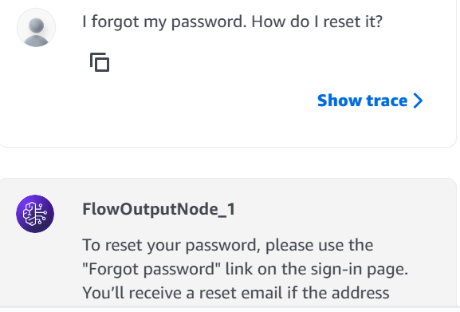
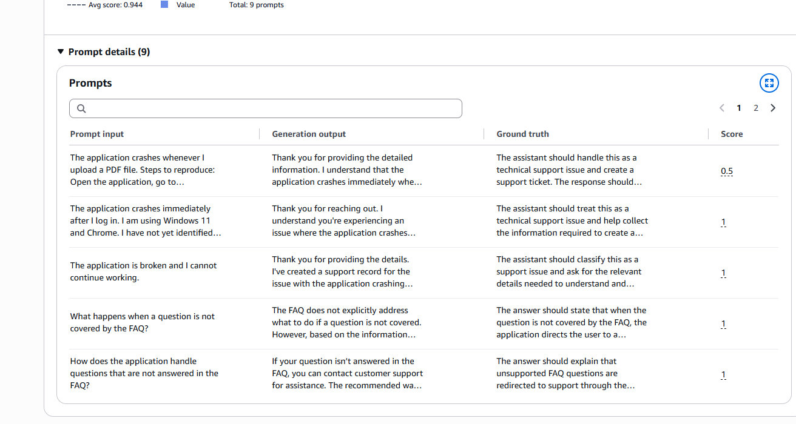
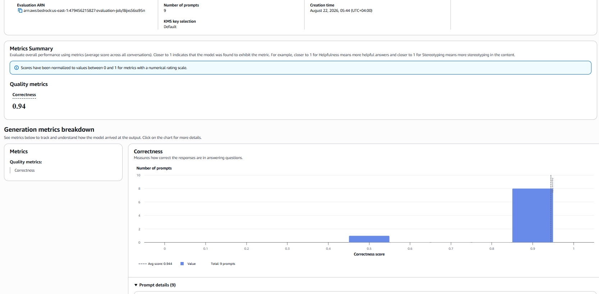

# AWS Agentic Support Project

## Lambda and DynamoDB

Run AWS CLI to set up Lambda and DynamoDB using `template.yaml`.

## AgentCore Harness

Create AgentCore Harness.

Create a Gateway to connect the AgentCore Harness with the Lambda function.

Add the tool to the AgentCore Harness.

### Test Agent

### Test Result

### DynamoDB Record

---

## Knowledge Base

Create a Knowledge Base.

Create an S3 bucket and upload the FAQ file to:

`bedrock-agentic-support-kb-44as231`

Create the Knowledge Base managed vector store and synchronize the data.

---

## Bedrock Flow

Create the Flow.

### Classifier Prompt Node

Create the classifier Prompt node.

Add the prompt and select Amazon Nova 2 Lite.

### Condition Node

Create the Condition node.

### Support Route

Create a Lambda function to invoke the AgentCore Harness from the Flow.

Add and configure the Lambda node.

Connect the Lambda node to the Output node and test the agent ticket-creation flow.

### Question Route

Add and configure the Knowledge Base node.

Add the FAQ Prompt node.

Use Amazon Nova 2 Lite and connect the node to the Knowledge Base.

Add the Output node and test the question flow.

### Covered Question

### Uncovered Question

.png)

### Other Route

Create the `other` Prompt node.

Configure the `other` response.

---

## Full Flow

---

## Evaluation

Run the evaluation process.

### Evaluation Score

## note 
this file edit by AI to be a formated as md file
create lambda bridge function with AI
